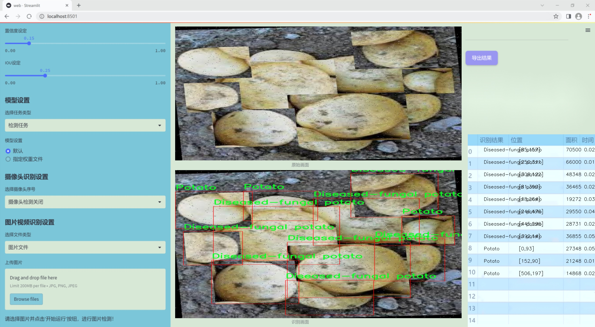
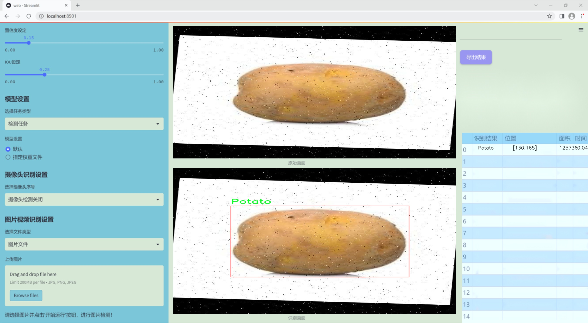
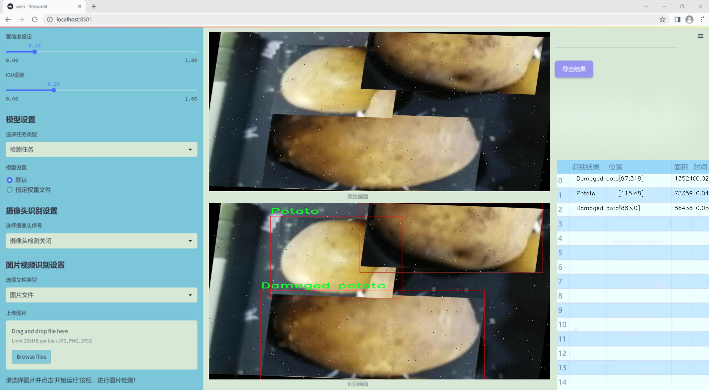
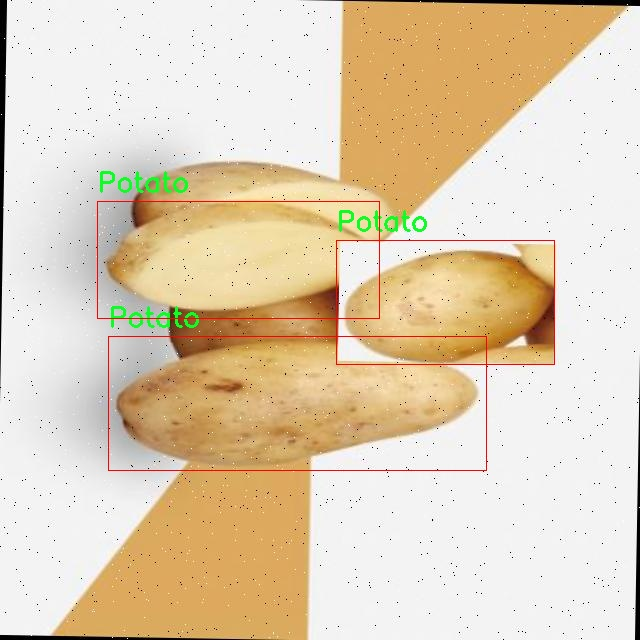
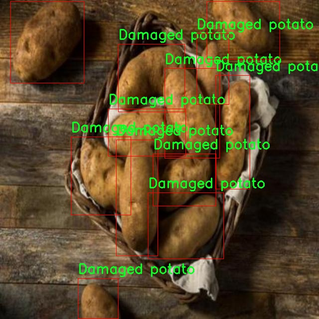
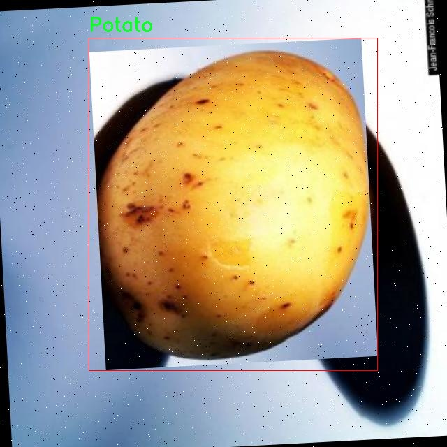
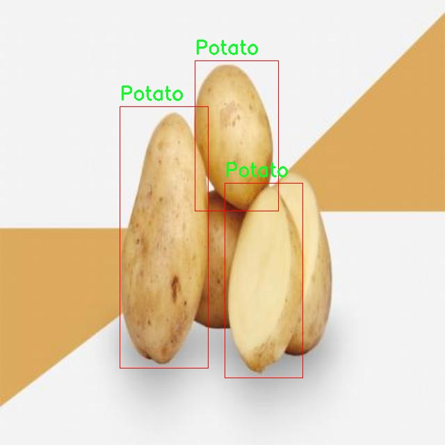

### 1.背景意义

研究背景与意义

随着全球人口的不断增长，农业生产面临着巨大的挑战，尤其是在食品安全和质量控制方面。土豆作为一种重要的粮食作物，其质量直接影响到消费者的健康和市场的经济效益。因此，建立一个高效、准确的土豆质量检测系统显得尤为重要。传统的土豆质量检测方法多依赖人工检查，不仅耗时耗力，而且容易受到主观因素的影响，导致检测结果的不一致性和不准确性。为了解决这一问题，基于计算机视觉和深度学习技术的自动化检测系统逐渐成为研究的热点。

在众多深度学习模型中，YOLO（You Only Look Once）系列因其高效的实时目标检测能力而被广泛应用。YOLOv11作为该系列的最新版本，具备更强的特征提取能力和更快的处理速度，能够在复杂的环境中实现高精度的目标检测。因此，基于改进YOLOv11的土豆质量检测系统的研究具有重要的理论和实践意义。

本研究将利用一个包含五类土豆样本的数据集，具体包括受损土豆、缺陷土豆、真菌病害土豆、正常土豆和发芽土豆。这些类别的划分不仅能够帮助识别土豆的质量问题，还能为农民和生产者提供有针对性的改进建议。通过对数据集的深入分析和模型的优化，我们期望能够提升土豆质量检测的准确性和效率，从而为农业生产提供科学依据，促进食品安全和农业可持续发展。最终，该系统的成功应用将有助于提升土豆的市场竞争力，保障消费者的健康，推动农业现代化进程。

### 2.视频效果

[2.1 视频效果](https://www.bilibili.com/video/BV1jyUVYcETa/)

### 3.图片效果







##### [项目涉及的源码数据来源链接](https://kdocs.cn/l/cszuIiCKVNis)**

注意：本项目提供训练的数据集和训练教程,由于版本持续更新,暂不提供权重文件（best.pt）,请按照6.训练教程进行训练后实现上图演示的效果。

### 4.数据集信息

##### 4.1 本项目数据集类别数＆类别名

train: ../train/images
val: ../valid/images
test: ../test/images

nc: 5
names: ['Damaged potato', 'Defected potato', 'Diseased-fungal potato', 'Potato', 'Sprouted potato']

roboflow:
  workspace: vegetable-quality-detection
  project: potato-detection-3et6q
  version: 11
  license: CC BY 4.0
  url: https://universe.roboflow.com/vegetable-quality-detection/potato-detection-3et6q/dataset/11


该项目为【目标检测】数据集，请在【训练教程和Web端加载模型教程（第三步）】这一步的时候按照【目标检测】部分的教程来训练

##### 4.2 本项目数据集信息介绍

本项目数据集信息介绍。本项目旨在改进YOLOv11的土豆质量检测系统，所使用的数据集专注于“土豆检测”这一主题。该数据集由多个部分组成，包括训练集、验证集和测试集，分别存放于指定的路径下：训练集位于“../train/images”，验证集位于“../valid/images”，测试集则在“../test/images”。数据集包含五个类别，具体为：受损土豆、缺陷土豆、真菌性疾病土豆、正常土豆以及发芽土豆。这些类别的划分旨在全面覆盖土豆在生长和存储过程中可能出现的各种质量问题，为模型的训练提供丰富的样本。

在数据集的构建过程中，确保了样本的多样性和代表性，以便于模型能够在不同的环境和条件下进行有效的学习。每个类别的样本均经过精心挑选和标注，确保数据的准确性和一致性。这对于提升YOLOv11在土豆质量检测中的性能至关重要。通过对这些类别的深入学习，模型将能够识别出不同质量的土豆，从而在实际应用中提供有效的质量控制和检测手段。

此外，数据集的使用遵循CC BY 4.0许可证，允许用户在遵循相应规定的前提下进行使用和修改。这为研究人员和开发者提供了良好的灵活性，使他们能够在不同的项目中应用该数据集。总之，本项目的数据集不仅为YOLOv11的改进提供了坚实的基础，也为土豆质量检测领域的研究与应用开辟了新的可能性。










### 5.全套项目环境部署视频教程（零基础手把手教学）

[5.1 所需软件PyCharm和Anaconda安装教程（第一步）](https://www.bilibili.com/video/BV1BoC1YCEKi/?spm_id_from=333.999.0.0&vd_source=bc9aec86d164b67a7004b996143742dc)


[5.2 安装Python虚拟环境创建和依赖库安装视频教程（第二步）](https://www.bilibili.com/video/BV1ZoC1YCEBw?spm_id_from=333.788.videopod.sections&vd_source=bc9aec86d164b67a7004b996143742dc)

### 6.改进YOLOv11训练教程和Web_UI前端加载模型教程（零基础手把手教学）

[6.1 改进YOLOv11训练教程和Web_UI前端加载模型教程（第三步）](https://www.bilibili.com/video/BV1BoC1YCEhR?spm_id_from=333.788.videopod.sections&vd_source=bc9aec86d164b67a7004b996143742dc)


按照上面的训练视频教程链接加载项目提供的数据集，运行train.py即可开始训练



     Epoch   gpu_mem       box       obj       cls    labels  img_size
     1/200     20.8G   0.01576   0.01955  0.007536        22      1280: 100%|██████████| 849/849 [14:42<00:00,  1.04s/it]
               Class     Images     Labels          P          R     mAP@.5 mAP@.5:.95: 100%|██████████| 213/213 [01:14<00:00,  2.87it/s]
                 all       3395      17314      0.994      0.957      0.0957      0.0843

     Epoch   gpu_mem       box       obj       cls    labels  img_size
     2/200     20.8G   0.01578   0.01923  0.007006        22      1280: 100%|██████████| 849/849 [14:44<00:00,  1.04s/it]
               Class     Images     Labels          P          R     mAP@.5 mAP@.5:.95: 100%|██████████| 213/213 [01:12<00:00,  2.95it/s]
                 all       3395      17314      0.996      0.956      0.0957      0.0845

     Epoch   gpu_mem       box       obj       cls    labels  img_size
     3/200     20.8G   0.01561    0.0191  0.006895        27      1280: 100%|██████████| 849/849 [10:56<00:00,  1.29it/s]
               Class     Images     Labels          P          R     mAP@.5 mAP@.5:.95: 100%|███████   | 187/213 [00:52<00:00,  4.04it/s]
                 all       3395      17314      0.996      0.957      0.0957      0.0845


###### [项目数据集下载链接](https://kdocs.cn/l/cszuIiCKVNis)

### 7.原始YOLOv11算法讲解


YOLO11 是 Ultralytics YOLO 系列的最新版本，结合了尖端的准确性、速度和效率，用于目标检测、分割、分类、定向边界框和姿态估计。与
YOLOv8 相比，它具有更少的参数和更好的结果，不难预见，YOLO11 在边缘设备上更高效、更快，将频繁出现在计算机视觉领域的最先进技术（SOTA）中。


**主要特点**

  * **增强的特征提取：**YOLO11 使用改进的主干和颈部架构来增强特征提取，以实现更精确的目标检测和复杂任务的性能。

  * **针对效率和速度优化：**精细的架构设计和优化的训练流程在保持准确性和性能之间最佳平衡的同时，提供更快的处理速度。

  * **更少的参数，更高的准确度：**YOLO11m 在 COCO 数据集上实现了比 YOLOv8m 更高的 mAP，参数减少了 22%，提高了计算效率，同时不牺牲准确度。

  * **跨环境的适应性：**YOLO11 可以无缝部署在边缘设备、云平台和配备 NVIDIA GPU 的系统上，确保最大的灵活性。

  * **支持广泛的任务范围：**YOLO11 支持各种计算机视觉任务，如目标检测、实例分割、图像分类、姿态估计和定向目标检测（OBB）。


### 8.200+种全套改进YOLOV11创新点原理讲解

#### 8.1 200+种全套改进YOLOV11创新点原理讲解大全

由于篇幅限制，每个创新点的具体原理讲解就不全部展开，具体见下列网址中的改进模块对应项目的技术原理博客网址【Blog】（创新点均为模块化搭建，原理适配YOLOv5~YOLOv11等各种版本）

[改进模块技术原理博客【Blog】网址链接](https://gitee.com/qunmasj/good)


#### 8.2 精选部分改进YOLOV11创新点原理讲解

###### 这里节选部分改进创新点展开原理讲解(完整的改进原理见上图和[改进模块技术原理博客链接](https://gitee.com/qunmasj/good)【如果此小节的图加载失败可以通过CSDN或者Github搜索该博客的标题访问原始博客，原始博客图片显示正常】


### YOLO-MS简介
实时目标检测，以YOLO系列为例，已在工业领域中找到重要应用，特别是在边缘设备（如无人机和机器人）中。与之前的目标检测器不同，实时目标检测器旨在在速度和准确性之间追求最佳平衡。为了实现这一目标，提出了大量的工作：从第一代DarkNet到CSPNet，再到最近的扩展ELAN，随着性能的快速增长，实时目标检测器的架构经历了巨大的变化。

尽管性能令人印象深刻，但在不同尺度上识别对象仍然是实时目标检测器面临的基本挑战。这促使作者设计了一个强大的编码器架构，用于学习具有表现力的多尺度特征表示。具体而言，作者从两个新的角度考虑为实时目标检测编码多尺度特征：

从局部视角出发，作者设计了一个具有简单而有效的分层特征融合策略的MS-Block。受到Res2Net的启发，作者在MS-Block中引入了多个分支来进行特征提取，但不同的是，作者使用了一个带有深度卷积的 Inverted Bottleneck Block块，以实现对大Kernel的高效利用。

从全局视角出发，作者提出随着网络加深逐渐增加卷积的Kernel-Size。作者在浅层使用小Kernel卷积来更高效地处理高分辨率特征。另一方面，在深层中，作者采用大Kernel卷积来捕捉广泛的信息。

基于以上设计原则，作者呈现了作者的实时目标检测器，称为YOLO-MS。为了评估作者的YOLO-MS的性能，作者在MS COCO数据集上进行了全面的实验。还提供了与其他最先进方法的定量比较，以展示作者方法的强大性能。如图1所示，YOLO-MS在计算性能平衡方面优于其他近期的实时目标检测器。


具体而言，YOLO-MS-XS在MS COCO上获得了43%+的AP得分，仅具有450万个可学习参数和8.7亿个FLOPs。YOLO-MS-S和YOLO-MS分别获得了46%+和51%+的AP，可学习参数分别为810万和2220万。此外，作者的工作还可以作为其他YOLO模型的即插即用模块。通常情况下，作者的方法可以将YOLOv11的AP从37%+显著提高到40%+，甚至还可以使用更少的参数和FLOPs。


#### Multi-Scale Building Block Design
CSP Block是一个基于阶段级梯度路径的网络，平衡了梯度组合和计算成本。它是广泛应用于YOLO系列的基本构建块。已经提出了几种变体，包括YOLOv4和YOLOv11中的原始版本，Scaled YOLOv4中的CSPVoVNet，YOLOv11中的ELAN，以及RTMDet中提出的大Kernel单元。作者在图2(a)和图2(b)中分别展示了原始CSP块和ELAN的结构。


上述实时检测器中被忽视的一个关键方面是如何在基本构建块中编码多尺度特征。其中一个强大的设计原则是Res2Net，它聚合了来自不同层次的特征以增强多尺度表示。然而，这一原则并没有充分探索大Kernel卷积的作用，而大Kernel卷积已经在基于CNN的视觉识别任务模型中证明有效。将大Kernel卷积纳入Res2Net的主要障碍在于它们引入的计算开销，因为构建块采用了标准卷积。在作者的方法中，作者提出用 Inverted Bottleneck Block替代标准的3 × 3卷积，以享受大Kernel卷积的好处。

基于前面的分析，作者提出了一个带有分层特征融合策略的全新Block，称为MS-Block，以增强实时目标检测器在提取多尺度特征时的能力，同时保持快速的推理速度。

MS-Block的具体结构如图2(c)所示。假设是输入特征。通过1×1卷积的转换后，X的通道维度增加到n*C。然后，作者将X分割成n个不同的组，表示为，其中。为了降低计算成本，作者选择n为3。

注意，除了之外，每个其他组都经过一个 Inverted Bottleneck Block层，用表示，其中k表示Kernel-Size，以获得。的数学表示如下：


根据这个公式，该博客的作者不将 Inverted Bottleneck Block层连接，使其作为跨阶段连接，并保留来自前面层的信息。最后，作者将所有分割连接在一起，并应用1×1卷积来在所有分割之间进行交互，每个分割都编码不同尺度的特征。当网络加深时，这个1×1卷积也用于调整通道数。

#### Heterogeneous Kernel Selection Protocol
除了构建块的设计外，作者还从宏观角度探讨了卷积的使用。之前的实时目标检测器在不同的编码器阶段采用了同质卷积（即具有相同Kernel-Size的卷积），但作者认为这不是提取多尺度语义信息的最佳选项。

在金字塔结构中，从检测器的浅阶段提取的高分辨率特征通常用于捕捉细粒度语义，将用于检测小目标。相反，来自网络较深阶段的低分辨率特征用于捕捉高级语义，将用于检测大目标。如果作者在所有阶段都采用统一的小Kernel卷积，深阶段的有效感受野（ERF）将受到限制，影响大目标的性能。在每个阶段中引入大Kernel卷积可以帮助解决这个问题。然而，具有大的ERF的大Kernel可以编码更广泛的区域，这增加了在小目标外部包含噪声信息的概率，并且降低了推理速度。

在这项工作中，作者建议在不同阶段中采用异构卷积，以帮助捕获更丰富的多尺度特征。具体来说，在编码器的第一个阶段中，作者采用最小Kernel卷积，而最大Kernel卷积位于最后一个阶段。随后，作者逐步增加中间阶段的Kernel-Size，使其与特征分辨率的增加保持一致。这种策略允许提取细粒度和粗粒度的语义信息，增强了编码器的多尺度特征表示能力。

正如图所示，作者将k的值分别分配给编码器中的浅阶段到深阶段，取值为3、5、7和9。作者将其称为异构Kernel选择（HKS）协议。


作者的HKS协议能够在深层中扩大感受野，而不会对浅层产生任何其他影响。此外，HKS不仅有助于编码更丰富的多尺度特征，还确保了高效的推理。

如表1所示，将大Kernel卷积应用于高分辨率特征会产生较高的计算开销。然而，作者的HKS协议在低分辨率特征上采用大Kernel卷积，从而与仅使用大Kernel卷积相比，大大降低了计算成本。


在实践中，作者经验性地发现，采用HKS协议的YOLO-MS的推理速度几乎与仅使用深度可分离的3 × 3卷积相同。

#### Architecture
如图所示，作者模型的Backbone由4个阶段组成，每个阶段后面跟随1个步长为2的3 × 3卷积进行下采样。在第3个阶段后，作者添加了1个SPP块，与RTMDet中一样。在作者的编码器上，作者使用PAFPN作为Neck来构建特征金字塔[31, 35]。它融合了从Backbone不同阶段提取的多尺度特征。Neck中使用的基本构建块也是作者的MS-Block，在其中使用3 × 3深度可分离卷积进行快速推理。

此外，为了在速度和准确性之间取得更好的平衡，作者将Backbone中多级特征的通道深度减半。作者提供了3个不同尺度的YOLO-MS变体，即YOLO-MS-XS、YOLO-MS-S和YOLO-MS。不同尺度的YOLO-MS的详细配置列在表2中。对于YOLO-MS的其他部分，作者将其保持与RTMDet相同。


### 9.系统功能展示

图9.1.系统支持检测结果表格显示

  图9.2.系统支持置信度和IOU阈值手动调节

  图9.3.系统支持自定义加载权重文件best.pt(需要你通过步骤5中训练获得)

  图9.4.系统支持摄像头实时识别

  图9.5.系统支持图片识别

  图9.6.系统支持视频识别

  图9.7.系统支持识别结果文件自动保存

  图9.8.系统支持Excel导出检测结果数据


### 10. YOLOv11核心改进源码讲解

#### 10.1 kagn_conv.py

以下是经过简化和注释的核心代码部分，保留了主要功能并添加了详细的中文注释：

```python
import torch
import torch.nn as nn
from functools import lru_cache

class KAGNConvNDLayer(nn.Module):
    def __init__(self, conv_class, norm_class, conv_w_fun, input_dim, output_dim, degree, kernel_size,
                 groups=1, padding=0, stride=1, dilation=1, dropout: float = 0.0, ndim: int = 2):
        super(KAGNConvNDLayer, self).__init__()
        
        # 初始化参数
        self.inputdim = input_dim  # 输入维度
        self.outdim = output_dim    # 输出维度
        self.degree = degree         # 多项式的度数
        self.kernel_size = kernel_size  # 卷积核大小
        self.padding = padding       # 填充
        self.stride = stride         # 步幅
        self.dilation = dilation     # 膨胀
        self.groups = groups         # 分组卷积的组数
        self.base_activation = nn.SiLU()  # 基础激活函数
        self.conv_w_fun = conv_w_fun  # 卷积权重函数
        self.ndim = ndim             # 维度
        self.dropout = nn.Dropout3d(p=dropout) if ndim == 3 else nn.Dropout2d(p=dropout) if ndim == 2 else nn.Dropout1d(p=dropout) if ndim == 1 else None

        # 检查参数有效性
        if groups <= 0:
            raise ValueError('groups must be a positive integer')
        if input_dim % groups != 0:
            raise ValueError('input_dim must be divisible by groups')
        if output_dim % groups != 0:
            raise ValueError('output_dim must be divisible by groups')

        # 创建基础卷积层和归一化层
        self.base_conv = nn.ModuleList([conv_class(input_dim // groups,
                                                   output_dim // groups,
                                                   kernel_size,
                                                   stride,
                                                   padding,
                                                   dilation,
                                                   groups=1,
                                                   bias=False) for _ in range(groups)])

        self.layer_norm = nn.ModuleList([norm_class(output_dim // groups) for _ in range(groups)])

        # 初始化多项式权重
        poly_shape = (groups, output_dim // groups, (input_dim // groups) * (degree + 1)) + tuple(kernel_size for _ in range(ndim))
        self.poly_weights = nn.Parameter(torch.randn(*poly_shape))  # 多项式权重
        self.beta_weights = nn.Parameter(torch.zeros(degree + 1, dtype=torch.float32))  # beta权重

        # 使用Kaiming均匀分布初始化卷积层权重
        for conv_layer in self.base_conv:
            nn.init.kaiming_uniform_(conv_layer.weight, nonlinearity='linear')

        nn.init.kaiming_uniform_(self.poly_weights, nonlinearity='linear')
        nn.init.normal_(self.beta_weights, mean=0.0, std=1.0 / ((kernel_size ** ndim) * self.inputdim * (self.degree + 1.0)))

    def beta(self, n, m):
        # 计算beta值
        return (
            ((m + n) * (m - n) * n ** 2) / (m ** 2 / (4.0 * n ** 2 - 1.0))
        ) * self.beta_weights[n]

    @lru_cache(maxsize=128)  # 缓存以避免重复计算Legendre多项式
    def gram_poly(self, x, degree):
        # 计算Gram多项式
        p0 = x.new_ones(x.size())  # p0 = 1
        if degree == 0:
            return p0.unsqueeze(-1)

        p1 = x  # p1 = x
        grams_basis = [p0, p1]

        for i in range(2, degree + 1):
            p2 = x * p1 - self.beta(i - 1, i) * p0  # 递归计算
            grams_basis.append(p2)
            p0, p1 = p1, p2

        return torch.cat(grams_basis, dim=1)  # 返回多项式基

    def forward_kag(self, x, group_index):
        # 前向传播
        basis = self.base_conv[group_index](self.base_activation(x))  # 基础卷积
        x = torch.tanh(x).contiguous()  # 对输入进行tanh归一化

        if self.dropout is not None:
            x = self.dropout(x)  # 应用dropout

        grams_basis = self.base_activation(self.gram_poly(x, self.degree))  # 计算Gram多项式基
        y = self.conv_w_fun(grams_basis, self.poly_weights[group_index], stride=self.stride, dilation=self.dilation, padding=self.padding, groups=1)  # 卷积运算
        y = self.base_activation(self.layer_norm[group_index](y + basis))  # 归一化和激活

        return y

    def forward(self, x):
        # 前向传播，处理分组
        split_x = torch.split(x, self.inputdim // self.groups, dim=1)
        output = []
        for group_ind, _x in enumerate(split_x):
            y = self.forward_kag(_x.clone(), group_ind)  # 对每个组进行前向传播
            output.append(y.clone())
        y = torch.cat(output, dim=1)  # 合并输出
        return y

# 3D、2D和1D卷积层的具体实现
class KAGNConv3DLayer(KAGNConvNDLayer):
    def __init__(self, input_dim, output_dim, kernel_size, degree=3, groups=1, padding=0, stride=1, dilation=1, dropout: float = 0.0):
        super(KAGNConv3DLayer, self).__init__(nn.Conv3d, nn.InstanceNorm3d, conv3d, input_dim, output_dim, degree, kernel_size, groups=groups, padding=padding, stride=stride, dilation=dilation, ndim=3, dropout=dropout)

class KAGNConv2DLayer(KAGNConvNDLayer):
    def __init__(self, input_dim, output_dim, kernel_size, degree=3, groups=1, padding=0, stride=1, dilation=1, dropout: float = 0.0, norm_layer=nn.InstanceNorm2d):
        super(KAGNConv2DLayer, self).__init__(nn.Conv2d, norm_layer, conv2d, input_dim, output_dim, degree, kernel_size, groups=groups, padding=padding, stride=stride, dilation=dilation, ndim=2, dropout=dropout)

class KAGNConv1DLayer(KAGNConvNDLayer):
    def __init__(self, input_dim, output_dim, kernel_size, degree=3, groups=1, padding=0, stride=1, dilation=1, dropout: float = 0.0):
        super(KAGNConv1DLayer, self).__init__(nn.Conv1d, nn.InstanceNorm1d, conv1d, input_dim, output_dim, degree, kernel_size, groups=groups, padding=padding, stride=stride, dilation=dilation, ndim=1, dropout=dropout)
```

### 代码说明
1. **KAGNConvNDLayer**: 这是一个通用的N维卷积层类，支持1D、2D和3D卷积。它包含了多项式基的计算和卷积操作。
2. **beta函数**: 计算用于Legendre多项式的beta值。
3. **gram_poly函数**: 计算Gram多项式的基。
4. **forward_kag函数**: 处理每个组的前向传播，执行卷积和归一化。
5. **forward函数**: 处理输入的分组并合并输出。
6. **KAGNConv3DLayer、KAGNConv2DLayer、KAGNConv1DLayer**: 这三个类分别是3D、2D和1D卷积层的具体实现，继承自`KAGNConvNDLayer`。

这个程序文件定义了一个名为 `kagn_conv.py` 的模块，主要实现了一个自定义的卷积层 `KAGNConvNDLayer` 及其在不同维度（1D、2D、3D）的具体实现。这个模块基于 PyTorch 框架，利用了深度学习中的卷积操作和归一化技术。

首先，`KAGNConvNDLayer` 类是一个通用的卷积层实现，支持任意维度的卷积操作。它的构造函数接受多个参数，包括输入和输出维度、卷积核大小、分组数、填充、步幅、扩张率、丢弃率等。构造函数中还定义了激活函数（使用 SiLU 激活函数），并根据输入的维度选择合适的丢弃层（Dropout）。在参数验证部分，确保分组数为正整数，并且输入和输出维度可以被分组数整除。

在卷积层的初始化中，使用 `nn.ModuleList` 来创建多个卷积层和归一化层，以支持分组卷积。每个卷积层的权重使用 Kaiming 均匀分布初始化，以提高训练的起始效果。此外，还定义了多项式权重和 beta 权重，并对其进行初始化。

`beta` 方法用于计算与 Legendre 多项式相关的权重，而 `gram_poly` 方法则计算 Legendre 多项式的基函数。为了避免重复计算，`gram_poly` 方法使用了 `lru_cache` 进行缓存。

在 `forward_kag` 方法中，首先对输入进行基本激活，然后通过基卷积层进行线性变换。接着，输入被归一化到 [-1, 1] 的范围，以便进行稳定的 Legendre 多项式计算。然后，应用丢弃层（如果有的话），并计算多项式基。最后，通过自定义的卷积函数 `conv_w_fun` 和多项式权重进行卷积操作，并通过归一化层和激活函数生成最终输出。

`forward` 方法则是整个层的前向传播逻辑，它将输入分成多个组，并对每个组调用 `forward_kag` 方法，最后将所有组的输出拼接在一起。

接下来的三个类 `KAGNConv3DLayer`、`KAGNConv2DLayer` 和 `KAGNConv1DLayer` 是对 `KAGNConvNDLayer` 的具体实现，分别针对三维、二维和一维卷积进行初始化，指定相应的卷积类和归一化类。这些类使得用户可以方便地创建适用于不同数据维度的卷积层。

总体而言，这个模块提供了一种灵活且高效的方式来实现自定义的卷积操作，适用于多种深度学习任务，尤其是在需要使用多项式特征的情况下。

#### 10.2 kan_conv.py

以下是保留的核心代码部分，并添加了详细的中文注释：

```python
import torch
import torch.nn as nn

class KANConvNDLayer(nn.Module):
    def __init__(self, conv_class, norm_class, input_dim, output_dim, spline_order, kernel_size,
                 groups=1, padding=0, stride=1, dilation=1,
                 ndim: int = 2, grid_size=5, base_activation=nn.GELU, grid_range=[-1, 1], dropout=0.0):
        super(KANConvNDLayer, self).__init__()
        
        # 初始化参数
        self.inputdim = input_dim  # 输入维度
        self.outdim = output_dim    # 输出维度
        self.spline_order = spline_order  # 样条阶数
        self.kernel_size = kernel_size  # 卷积核大小
        self.padding = padding  # 填充
        self.stride = stride  # 步幅
        self.dilation = dilation  # 膨胀
        self.groups = groups  # 分组数
        self.ndim = ndim  # 维度
        self.grid_size = grid_size  # 网格大小
        self.base_activation = base_activation()  # 基础激活函数
        self.grid_range = grid_range  # 网格范围

        # 初始化dropout层
        self.dropout = None
        if dropout > 0:
            if ndim == 1:
                self.dropout = nn.Dropout1d(p=dropout)
            elif ndim == 2:
                self.dropout = nn.Dropout2d(p=dropout)
            elif ndim == 3:
                self.dropout = nn.Dropout3d(p=dropout)

        # 检查分组参数的有效性
        if groups <= 0:
            raise ValueError('groups must be a positive integer')
        if input_dim % groups != 0:
            raise ValueError('input_dim must be divisible by groups')
        if output_dim % groups != 0:
            raise ValueError('output_dim must be divisible by groups')

        # 创建基础卷积层和样条卷积层
        self.base_conv = nn.ModuleList([conv_class(input_dim // groups,
                                                   output_dim // groups,
                                                   kernel_size,
                                                   stride,
                                                   padding,
                                                   dilation,
                                                   groups=1,
                                                   bias=False) for _ in range(groups)])

        self.spline_conv = nn.ModuleList([conv_class((grid_size + spline_order) * input_dim // groups,
                                                     output_dim // groups,
                                                     kernel_size,
                                                     stride,
                                                     padding,
                                                     dilation,
                                                     groups=1,
                                                     bias=False) for _ in range(groups)])

        # 创建归一化层和激活层
        self.layer_norm = nn.ModuleList([norm_class(output_dim // groups) for _ in range(groups)])
        self.prelus = nn.ModuleList([nn.PReLU() for _ in range(groups)])

        # 生成样条网格
        h = (self.grid_range[1] - self.grid_range[0]) / grid_size
        self.grid = torch.linspace(
            self.grid_range[0] - h * spline_order,
            self.grid_range[1] + h * spline_order,
            grid_size + 2 * spline_order + 1,
            dtype=torch.float32
        )

        # 使用Kaiming均匀分布初始化卷积层权重
        for conv_layer in self.base_conv:
            nn.init.kaiming_uniform_(conv_layer.weight, nonlinearity='linear')

        for conv_layer in self.spline_conv:
            nn.init.kaiming_uniform_(conv_layer.weight, nonlinearity='linear')

    def forward_kan(self, x, group_index):
        # 对输入应用基础激活函数并进行线性变换
        base_output = self.base_conv[group_index](self.base_activation(x))

        x_uns = x.unsqueeze(-1)  # 扩展维度以进行样条操作
        target = x.shape[1:] + self.grid.shape  # 计算目标形状
        grid = self.grid.view(*list([1 for _ in range(self.ndim + 1)] + [-1, ])).expand(target).contiguous().to(x.device)

        # 计算样条基
        bases = ((x_uns >= grid[..., :-1]) & (x_uns < grid[..., 1:])).to(x.dtype)

        # 计算多阶样条基
        for k in range(1, self.spline_order + 1):
            left_intervals = grid[..., :-(k + 1)]
            right_intervals = grid[..., k:-1]
            delta = torch.where(right_intervals == left_intervals, torch.ones_like(right_intervals),
                                right_intervals - left_intervals)
            bases = ((x_uns - left_intervals) / delta * bases[..., :-1]) + \
                    ((grid[..., k + 1:] - x_uns) / (grid[..., k + 1:] - grid[..., 1:(-k)]) * bases[..., 1:])
        bases = bases.contiguous()
        bases = bases.moveaxis(-1, 2).flatten(1, 2)  # 调整基的形状
        spline_output = self.spline_conv[group_index](bases)  # 应用样条卷积

        # 归一化和激活
        x = self.prelus[group_index](self.layer_norm[group_index](base_output + spline_output))

        # 应用dropout
        if self.dropout is not None:
            x = self.dropout(x)

        return x

    def forward(self, x):
        # 将输入分割为多个组
        split_x = torch.split(x, self.inputdim // self.groups, dim=1)
        output = []
        for group_ind, _x in enumerate(split_x):
            y = self.forward_kan(_x.clone(), group_ind)  # 对每个组进行前向传播
            output.append(y.clone())
        y = torch.cat(output, dim=1)  # 将输出拼接
        return y
```

### 代码说明：
1. **KANConvNDLayer类**：这是一个自定义的神经网络层，支持多维卷积和样条插值。它继承自`nn.Module`。
2. **初始化方法**：接收多个参数以设置卷积层、归一化层、激活函数等，并进行必要的参数检查。
3. **前向传播方法**：`forward_kan`方法处理输入数据，计算基础卷积和样条卷积的输出，并进行归一化和激活。`forward`方法则将输入分割为多个组，并对每个组调用`forward_kan`进行处理。
4. **样条基的计算**：通过输入值和网格计算样条基，以便在卷积操作中使用。

这个类的设计使得它可以灵活地处理不同维度的卷积操作，同时引入了样条插值的机制以增强模型的表达能力。

这个程序文件定义了一个名为 `KANConvNDLayer` 的神经网络层，主要用于实现一种新的卷积操作，结合了样条基函数的特性。该层支持多维卷积（1D、2D、3D），并且通过样条插值增强了特征提取的能力。

首先，`KANConvNDLayer` 类的构造函数接受多个参数，包括输入和输出维度、卷积核大小、样条的阶数、分组数、填充、步幅、扩张率、网格大小、基础激活函数、网格范围和丢弃率等。构造函数中，首先进行了一些参数的验证，比如分组数必须为正整数，输入和输出维度必须能够被分组数整除。接着，初始化了基础卷积层、样条卷积层、层归一化层和激活函数（PReLU）。

在初始化基础卷积和样条卷积时，使用了 `nn.ModuleList` 来存储每个组的卷积层，并且通过 Kaiming 均匀分布初始化权重，以便于训练的开始。

`forward_kan` 方法是该层的核心，负责执行前向传播。它首先对输入应用基础激活函数，然后进行线性变换。接着，扩展输入的维度以便进行样条操作，计算样条基函数。通过定义的网格和输入值，计算出样条基函数的值，并将其传递给样条卷积层。最后，结合基础卷积和样条卷积的输出，经过层归一化和激活函数处理后，返回最终的输出。

`forward` 方法则负责处理多组输入数据。它将输入张量按组进行分割，并对每组数据调用 `forward_kan` 方法进行处理，最后将所有组的输出拼接在一起，形成最终的输出。

此外，文件中还定义了三个子类 `KANConv1DLayer`、`KANConv2DLayer` 和 `KANConv3DLayer`，分别用于处理一维、二维和三维卷积。这些子类通过调用父类的构造函数，传入相应的卷积类和归一化类，简化了多维卷积层的创建过程。

整体来看，这个程序文件实现了一个灵活且功能强大的卷积层，能够在多维数据上进行复杂的特征提取，适用于需要样条插值的深度学习任务。

#### 10.3 dynamic_snake_conv.py

以下是代码中最核心的部分，并附上详细的中文注释：

```python
import torch
import torch.nn as nn
from ..modules.conv import Conv

__all__ = ['DySnakeConv']

class DySnakeConv(nn.Module):
    def __init__(self, inc, ouc, k=3) -> None:
        super().__init__()
        
        # 初始化三个卷积层
        self.conv_0 = Conv(inc, ouc, k)  # 标准卷积
        self.conv_x = DSConv(inc, ouc, 0, k)  # 沿x轴的动态蛇形卷积
        self.conv_y = DSConv(inc, ouc, 1, k)  # 沿y轴的动态蛇形卷积
    
    def forward(self, x):
        # 前向传播，返回三个卷积的结果拼接
        return torch.cat([self.conv_0(x), self.conv_x(x), self.conv_y(x)], dim=1)

class DSConv(nn.Module):
    def __init__(self, in_ch, out_ch, morph, kernel_size=3, if_offset=True, extend_scope=1):
        """
        动态蛇形卷积
        :param in_ch: 输入通道数
        :param out_ch: 输出通道数
        :param kernel_size: 卷积核大小
        :param extend_scope: 扩展范围（默认1）
        :param morph: 卷积核的形态，主要分为沿x轴（0）和y轴（1）
        :param if_offset: 是否需要偏移，如果为False，则为标准卷积核
        """
        super(DSConv, self).__init__()
        # 使用偏移卷积来学习可变形偏移
        self.offset_conv = nn.Conv2d(in_ch, 2 * kernel_size, 3, padding=1)  # 偏移卷积
        self.bn = nn.BatchNorm2d(2 * kernel_size)  # 批归一化
        self.kernel_size = kernel_size

        # 定义沿x轴和y轴的动态蛇形卷积
        self.dsc_conv_x = nn.Conv2d(
            in_ch,
            out_ch,
            kernel_size=(kernel_size, 1),
            stride=(kernel_size, 1),
            padding=0,
        )
        self.dsc_conv_y = nn.Conv2d(
            in_ch,
            out_ch,
            kernel_size=(1, kernel_size),
            stride=(1, kernel_size),
            padding=0,
        )

        self.gn = nn.GroupNorm(out_ch // 4, out_ch)  # 组归一化
        self.act = Conv.default_act  # 默认激活函数

        self.extend_scope = extend_scope
        self.morph = morph
        self.if_offset = if_offset

    def forward(self, f):
        # 前向传播
        offset = self.offset_conv(f)  # 计算偏移
        offset = self.bn(offset)  # 批归一化
        offset = torch.tanh(offset)  # 将偏移限制在[-1, 1]之间
        input_shape = f.shape
        dsc = DSC(input_shape, self.kernel_size, self.extend_scope, self.morph)  # 初始化DSC
        deformed_feature = dsc.deform_conv(f, offset, self.if_offset)  # 进行可变形卷积

        # 根据形态选择相应的卷积
        if self.morph == 0:
            x = self.dsc_conv_x(deformed_feature.type(f.dtype))  # 沿x轴卷积
        else:
            x = self.dsc_conv_y(deformed_feature.type(f.dtype))  # 沿y轴卷积
        
        x = self.gn(x)  # 组归一化
        x = self.act(x)  # 激活
        return x

class DSC(object):
    def __init__(self, input_shape, kernel_size, extend_scope, morph):
        self.num_points = kernel_size  # 卷积核的点数
        self.width = input_shape[2]  # 输入特征图的宽度
        self.height = input_shape[3]  # 输入特征图的高度
        self.morph = morph  # 卷积核形态
        self.extend_scope = extend_scope  # 偏移范围

        # 定义特征图的形状
        self.num_batch = input_shape[0]  # 批大小
        self.num_channels = input_shape[1]  # 通道数

    def deform_conv(self, input, offset, if_offset):
        # 进行可变形卷积
        y, x = self._coordinate_map_3D(offset, if_offset)  # 计算坐标图
        deformed_feature = self._bilinear_interpolate_3D(input, y, x)  # 双线性插值
        return deformed_feature  # 返回变形后的特征图
```

### 代码说明：
1. **DySnakeConv** 类是一个卷积神经网络模块，包含三个卷积层：一个标准卷积和两个动态蛇形卷积（分别沿x轴和y轴）。
2. **DSConv** 类实现了动态蛇形卷积，能够根据输入特征图的偏移量进行变形卷积。
3. **DSC** 类用于计算变形卷积的坐标图和进行双线性插值，最终返回变形后的特征图。

这个程序文件定义了一个动态蛇形卷积（Dynamic Snake Convolution）模块，主要由两个类组成：`DySnakeConv` 和 `DSConv`，以及一个辅助类 `DSC`。这些类结合了标准卷积和可变形卷积的特性，旨在提高卷积神经网络在处理图像时的灵活性和表现力。

首先，`DySnakeConv` 类是一个卷积模块的封装，它在初始化时接受输入通道数（`inc`）、输出通道数（`ouc`）和卷积核大小（`k`）。在其构造函数中，创建了三个卷积层：`conv_0` 是标准卷积，`conv_x` 和 `conv_y` 是动态蛇形卷积，分别沿着 x 轴和 y 轴进行操作。在前向传播方法中，输入通过这三个卷积层进行处理，最终将它们的输出在通道维度上拼接在一起。

接下来，`DSConv` 类实现了动态蛇形卷积的具体逻辑。它的构造函数接受输入通道、输出通道、卷积核大小、形态（morph）、是否需要偏移（if_offset）以及扩展范围（extend_scope）。在这个类中，首先定义了一个用于学习可变形偏移的卷积层 `offset_conv`，并对其输出进行批归一化。接着，定义了两个卷积层 `dsc_conv_x` 和 `dsc_conv_y`，分别用于处理沿 x 轴和 y 轴的卷积操作。最后，定义了一个组归一化层和一个激活函数。

在 `DSConv` 的前向传播方法中，首先通过 `offset_conv` 计算出偏移量，并进行归一化处理。然后，使用 `DSC` 类生成坐标图，并根据偏移量对输入特征图进行变形卷积。根据形态参数的不同，选择相应的卷积层进行处理，并返回经过激活函数处理后的结果。

`DSC` 类是实现变形卷积的核心部分。它的构造函数接收输入特征图的形状、卷积核大小、扩展范围和形态参数。在这个类中，定义了 `_coordinate_map_3D` 方法来生成变形卷积所需的坐标图，并根据偏移量进行调整。然后，使用 `_bilinear_interpolate_3D` 方法进行双线性插值，得到变形后的特征图。

总体来说，这个程序实现了一个灵活的卷积模块，能够根据输入特征图的特征动态调整卷积核的位置，从而提升卷积神经网络在图像处理任务中的性能。

#### 10.4 metaformer.py

以下是代码中最核心的部分，并附上详细的中文注释：

```python
import torch
import torch.nn as nn
import torch.nn.functional as F

class MF_Attention(nn.Module):
    """
    自注意力机制实现，基于Transformer的结构。
    """
    def __init__(self, dim, head_dim=32, num_heads=None, qkv_bias=False,
                 attn_drop=0., proj_drop=0., proj_bias=False):
        super().__init__()

        # 头部维度和缩放因子
        self.head_dim = head_dim
        self.scale = head_dim ** -0.5

        # 计算头的数量
        self.num_heads = num_heads if num_heads else dim // head_dim
        if self.num_heads == 0:
            self.num_heads = 1
        
        # 计算注意力维度
        self.attention_dim = self.num_heads * self.head_dim

        # 定义Q、K、V的线性变换
        self.qkv = nn.Linear(dim, self.attention_dim * 3, bias=qkv_bias)
        self.attn_drop = nn.Dropout(attn_drop)  # 注意力的dropout
        self.proj = nn.Linear(self.attention_dim, dim, bias=proj_bias)  # 输出的线性变换
        self.proj_drop = nn.Dropout(proj_drop)  # 输出的dropout

    def forward(self, x):
        B, H, W, C = x.shape  # B: 批量大小, H: 高度, W: 宽度, C: 通道数
        N = H * W  # 计算总的token数量

        # 计算Q、K、V
        qkv = self.qkv(x).reshape(B, N, 3, self.num_heads, self.head_dim).permute(2, 0, 3, 1, 4)
        q, k, v = qkv.unbind(0)  # 分离Q、K、V

        # 计算注意力权重
        attn = (q @ k.transpose(-2, -1)) * self.scale  # 矩阵乘法并缩放
        attn = attn.softmax(dim=-1)  # softmax归一化
        attn = self.attn_drop(attn)  # 应用dropout

        # 计算输出
        x = (attn @ v).transpose(1, 2).reshape(B, H, W, self.attention_dim)  # 应用注意力权重
        x = self.proj(x)  # 线性变换
        x = self.proj_drop(x)  # 应用dropout
        return x  # 返回输出

class MetaFormerBlock(nn.Module):
    """
    MetaFormer模块的实现，包含自注意力和MLP结构。
    """
    def __init__(self, dim,
                 token_mixer=nn.Identity, mlp=Mlp,
                 norm_layer=partial(LayerNormWithoutBias, eps=1e-6),
                 drop=0., drop_path=0.,
                 layer_scale_init_value=None, res_scale_init_value=None):
        super().__init__()

        # 归一化层
        self.norm1 = norm_layer(dim)
        self.token_mixer = token_mixer(dim=dim, drop=drop)  # token混合层
        self.drop_path1 = DropPath(drop_path) if drop_path > 0. else nn.Identity()  # 随机丢弃路径
        self.layer_scale1 = Scale(dim=dim, init_value=layer_scale_init_value) if layer_scale_init_value else nn.Identity()  # 层缩放
        self.res_scale1 = Scale(dim=dim, init_value=res_scale_init_value) if res_scale_init_value else nn.Identity()  # 残差缩放

        # 第二个归一化层和MLP
        self.norm2 = norm_layer(dim)
        self.mlp = mlp(dim=dim, drop=drop)
        self.drop_path2 = DropPath(drop_path) if drop_path > 0. else nn.Identity()
        self.layer_scale2 = Scale(dim=dim, init_value=layer_scale_init_value) if layer_scale_init_value else nn.Identity()
        self.res_scale2 = Scale(dim=dim, init_value=res_scale_init_value) if res_scale_init_value else nn.Identity()
        
    def forward(self, x):
        x = x.permute(0, 2, 3, 1)  # 调整维度顺序
        # 第一部分：自注意力
        x = self.res_scale1(x) + \
            self.layer_scale1(
                self.drop_path1(
                    self.token_mixer(self.norm1(x))
                )
            )
        # 第二部分：MLP
        x = self.res_scale2(x) + \
            self.layer_scale2(
                self.drop_path2(
                    self.mlp(self.norm2(x))
                )
            )
        return x.permute(0, 3, 1, 2)  # 恢复维度顺序
```

### 代码说明：
1. **MF_Attention**: 实现了自注意力机制，主要通过计算查询（Q）、键（K）和值（V）来生成注意力权重，并通过这些权重对输入进行加权求和。
2. **MetaFormerBlock**: 实现了一个MetaFormer模块，包含了自注意力机制和多层感知机（MLP），同时使用了层归一化和残差连接来提高模型的表现。

这个程序文件 `metaformer.py` 实现了一系列用于构建 MetaFormer 模型的模块和类，主要基于 PyTorch 框架。文件中包含了多种自定义的神经网络层和功能模块，旨在为视觉任务提供有效的模型架构。

首先，文件引入了一些必要的库，包括 `torch` 和 `torch.nn`，并定义了一些通用的模块名称。接着，定义了多个类，每个类实现了特定的功能。

`Scale` 类用于对输入向量进行元素级别的缩放，初始化时可以设置缩放的维度、初始值和是否可训练。`SquaredReLU` 和 `StarReLU` 类则实现了不同形式的激活函数，前者是平方的 ReLU，而后者则在 ReLU 的基础上增加了可学习的缩放和偏置。

`MF_Attention` 类实现了标准的自注意力机制，主要用于处理输入的查询、键和值，计算注意力权重，并通过线性变换和 dropout 进行投影。`RandomMixing` 类则使用随机矩阵对输入进行混合，增强模型的表达能力。

`LayerNormGeneral` 类提供了一种通用的层归一化实现，允许用户根据输入的形状和需求自定义归一化的维度、缩放和偏置。`LayerNormWithoutBias` 类是一个更高效的版本，直接利用优化过的层归一化函数。

`SepConv` 类实现了反向可分离卷积，结合了线性层和深度卷积，适用于高效的特征提取。`Pooling` 类则实现了一种特定的池化操作，用于计算输入与池化结果之间的差异。

`Mlp` 类实现了多层感知机，通常用于 MetaFormer 模型中的前馈网络，包含两个线性层和激活函数。`ConvolutionalGLU` 类则实现了一种卷积门控线性单元，结合了卷积和激活操作。

`MetaFormerBlock` 和 `MetaFormerCGLUBlock` 类分别实现了 MetaFormer 的基本模块，前者使用标准的 MLP，后者使用卷积门控线性单元。两者都包含归一化、残差连接和可选的 dropout 机制，以增强模型的稳定性和性能。

总体而言，这个文件提供了构建 MetaFormer 模型所需的基础组件，支持多种变体和配置，适用于不同的视觉任务和数据集。通过组合这些模块，用户可以灵活地设计和训练符合特定需求的深度学习模型。

### 11.完整训练+Web前端界面+200+种全套创新点源码、数据集获取


# [下载链接：https://mbd.pub/o/bread/Z5aTlZtu](https://mbd.pub/o/bread/Z5aTlZtu)